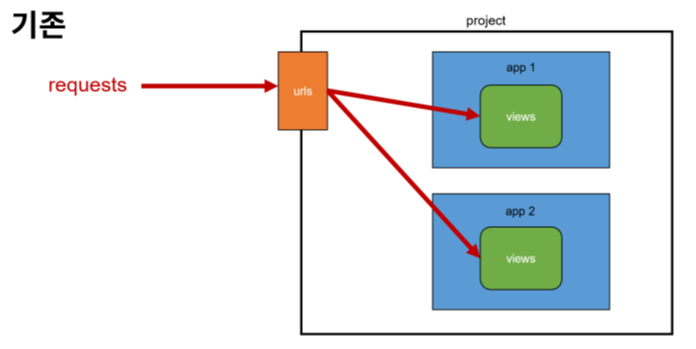
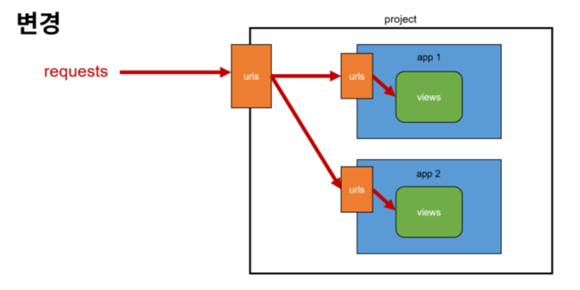

# Django URLs

<br>

## 개요
- URL dispatcher
  - URL 패턴을 정의하고 해당 패턴이 일치하는 요청을 처리할 view 함수를 연결(매핑)


## 변수와 URL
- Veriable Routing
  - URL 일부에 변수를 포함시키는 것 (변수는 view 함수의 인자로 전달 할 수 있음)

  - ```python
    # <path_converter:variable_name> <타입 : 변수이름>
    path('articlse/<int:num>/', views.hello)
    path('hello/<str:name>/', views.greeting)
    ```
- Path converters
  - URL 변수의 타입을 지정 (str, int 등 5가지 타입 지원)


## App의 URL
- App URL mapping
  - 각 앱에 URL을 정의하는 것
  - 프로젝트와 각각의 앱이 URL을 나누어 관리하여 주소 관리를 편하게 하기 위함 => 유지보수 용이

- 기존
  

- 변경
  
- 코드
- ```python
  # firstpjt/urls.py
  from django.urls import path, include

  urlpatterns = [
    path('admin/', admin.site.urls),
    path('articles/', include('articles.urls')),
    path('pages/', include('pages.urls')),
  ]
  ```
- ```python
  # articles/urls.py
  from django.urls import path
  from . import views

  urlpatterns = [
    path('index/', views.index),
    path('dinner/', views.dinner),
    path('search/', views.search),
  ]
  ```
- ```python
  # pages/urls.py
  from django.urls import path
  from . import views

  urlpatterns = [
    path('index/', views.index, name='index'),
  ]
  ```

- `include()`
  - 다른 URL들을 참조할 수 있도록 돕는 함수
  - URL의 그 시점까지 일치하는 부분을 잘라내고, 남은 문자열 부분을 후속 처리를 위해 include된 URL로 전달


## URL 이름 지정
- name 인자 작성
  - 기존 `articles/` 주소가 `articles/index/` 주소로 변경
  - 기존 `articles/` 주소를 사용했던 모든 위치를 찾아 변경해야 한다.
- ```python
  # firstpjt/urls.py
  path('articles/', include('articles.urls')),
  ```
- ```python
  # articles/urls.py
  path('index/', views.index, name='index'),
  path('dinner/', views.dinner, name='dinner'),
  path('search/', views.search, name='search'),
  ```
- ```python
  # pages/urls.py
  path('index/', views.index, name='index'),
  ```

- Naming URL patterns
  - URL에 이름을 지정하는 것 (path 함수의 name 인자를 정의해서 사용)

- `url` tag
  - 주어진 URL 패턴의 이름과 일치하는 절대 경로 주소로 반환
  - ```python
    
    ```


## URL Namespace
- URL 이름 지정 후 남은 문제
  - articles 앱의 url 이름과 pages 앱의 url 이름이 같음
  - 단순히 이름만으로는 분리가 어려운 상황

- `app_name` 속성 지정
  - url 이름 + app 이름표 붙이기
  - ```python
    app_name = 'articles'
    urlpatterns = [
      path('index/', views.index, name='index'),
    ]
    ```

- URL tag의 변화
  - ```python
     => 
    ```


## app_name 지정 후 주의사항
  - app_name을 지정한 이후에는 url태그에서 반드시 `app_name:url_name` 형태로만 사용할 수 있음
  - 그렇지 않으면 ```NoReverseMatch 에러가 발생
  - 즉, app_name 지정 후 다음과 같은 표기는 사용 불가
  - ```python
    
    ```


## Trailing Slashes
  - django는 URL 끝에 '/'가 없다면 자동으로 붙임
  - django의 url 설계 철학
    - 기술적인 측면에서 `foo.com/bar`와 `foo.com/bar/`는 서로 다른 URL이다.
  - 검색 엔진 로봇이나 웹 트래픽 분석 도구에서는 이 두 주소를 서로 다른 페이지로 본다.
  - Django는 검색 엔진이 혼동하지 않게 하기 위해 사용
  - 모든 프레임워크가 이렇게 동작하지는 않음