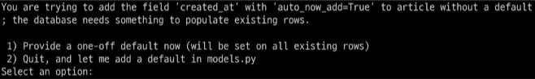

# Django Model

<br>

## Model
- SQLite
  - 오픈소스 RDBMS 중 하나이며 django의 기본 DB로 사용됨
  - DB가 파일로 존재하며 가볍고 호환성이 좋음

- django Model
  - DB의 테이블을 정의하고 데이터를 조작할 수 있는 기능들을 제공
  - 테이블 구조를 설계하는 '청사진(blueprint)'

- model 클래스 작성
  - id 필드는 자동생성
  - django.db.models 모듈의 Model이라는 부모 클래스를 상속 받아 작성
  - 개발자는 테이블 구조를 어떻게 설계할 지에 대한 코드만 작성하도록 하기 위함

- 클래스 변수명
  - 테이블의 각 필드 이름

- model Field 메서드
  - 테이블 필드의 데이터 타입

- model Field 메서드 키워드 인자
  - 테이블 필드의 제약조건 관련 설정

- ```python
    class Article(models.Model):
      # 필드 이름/ 데이터 타입/ 제약조건
      title = models.CharField(max_length=10)
      content = models.TextField()
    ```


## Migrations
- Migrations
  - model 클래스의 변경사항(핃드 생성, 추가 수정 등)을 DB에 최종 반영하는 방법

- 과정
  - model class => makemigrations 명령어 입력 => migrations 파일 생성 => migrate 명령어 입력 => db.sqlite3

- Migrations 핵심 명령어
  - `python manage.py makemigrations`
    - model class를 기반으로 설계도(migration) 작성
  - `python manage.py migrate`
    - 만들어진 설계도를 DB에 전달하여 반영
  - migrate 입력후 DB내에 생성된 테이블 확인

- 이미 생성된 테이블에 필드 추가
1. 추가 필드 작성
  - ```python
    class Article(models.Model):
      title = models.CharField(max_length=10)
      content = models.TextField()
      # 추가 필드
      created_at = models.DateTimeField(auto_now_add=True)
      updated_at = models.DateTimeField(auto_now=True)
    ```
2. `python manage.py makemigrations` 명령어 입력
    - 추가 값 설정 -1
      - 이미 기존 테이블이 존재하기 때문에 필드를 추가 할 때 필드의 기본 값 설정이 필요
      - 1번은 직접 기본 값을 입력하는 방법
      - 2번은 현대 대화에서 나간후 models.py에 기본 값 관련 설정을 하는 방법
      
    - 추가 값 설정 -2
      - 추가하는 필드에 필드의 기본 값을 입력 해야 하는상황
      - 날짜 데이터이기 때문에 직접 입력하기 보다는 django가 제안하는 기본 값을 사용하는 것을 권장
      - 아무것도 입력하지 않고 Enter를 누르면 django가 제안하는 기본 값으로 설정됨 (timezone.now)
      
    - 추가된 2번째 migration 파일이 생성됨을 확인
    - migrate 후 필드가 추가 되었는지 확인
    - model class에 변경사항이 생겼다면, 반드시 새로운 설계도를 생성, 이를 DB에 반영해야 한다.
    - Model class 작성 및 수정 => makemigrations => migrate

- `ChrarField()`
  - 길이의 제한이 있는 문자열을 넣을 때 사용
  - 필드의 최대 길이를 결정하는 max_langth는 필수 인자

- `TextField()`
  - 글자의 수가 많을 때 사용

- `DateTimeField()`
  - 날짜와 시간을 넣을 때 사용
  - DateTimeField의 선택 인자
    - auto_now
      - 데이터가 저장될 때마다 자동으로 현재 날짜시간을 저장
    - auto_now_add
      - 데이터가 처음 생성될 때만 자동으로 현재 날짜시간을 저장


## Admin site
- Automatic admin interface
  - django는 추가 설치 및 설정 없이 자동으로 관리자 인터페이스를 제공
  - 데이터 관련 테스트 및 확인을 하기에 매우 유용

- admin 계정 생성
  - `python manage.py createsuperuser`
  - id 입력
  - email은 선택사항이기 때문에 입력하지 않고 진행 가능
  - 비밀번호 생성 시 보안상 터미널에 출력되지 않으니 무시하고 입력을 진행

- admin에 모델 클래스 등록
  - admin.py에 등록하지 않으면 admin site에서 확인할 수 없음
  - ```python
    from django.contrib import admin
    from .models import Article

    # Register your models here.
    admin.site.register(Article)
    ```
- 로그인 후 등록된 모델 클래스 확인
- 데이터 CRUD 테스트
- 실제 테이블에 저장되었는지 확인

## 참고

- 데이터 베이스 초기화
  1. migration 파일 삭제
  2. db.sqlite3 파일 삭제
  - migrations 폴더를 지우지 않도록 주의

- migrations 기타 명령어
  - `python manage.py showigrations`
    - migrations 파일들이 migrate 됐는지 안됐는지 여부를 확인하는 용도
    - [X]표시가 있으면 migrate가 완료되었음을 의미
  - `python manage.py sqlmigrate articles 0001`
    - 해당 migrations 파일이 SQL문으로 어떻게 해석 되어 DB에 전달되는지 확인하는 용도

- 첫 migrate시 출력 내용이 많은 이유?
  - 기본적으로 Django 프로젝트가 동작하기 위해 작성 되어있는 기본 내장 app들에 대한 migration 파일들이 함께 migration 되기 때문이다.